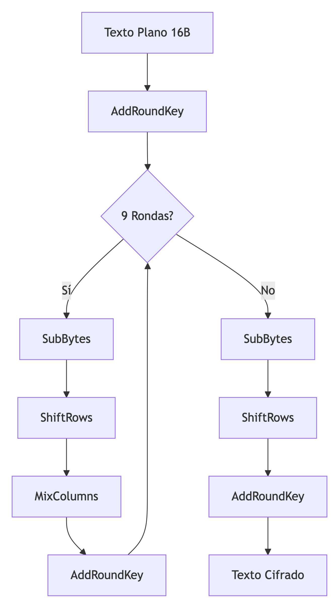
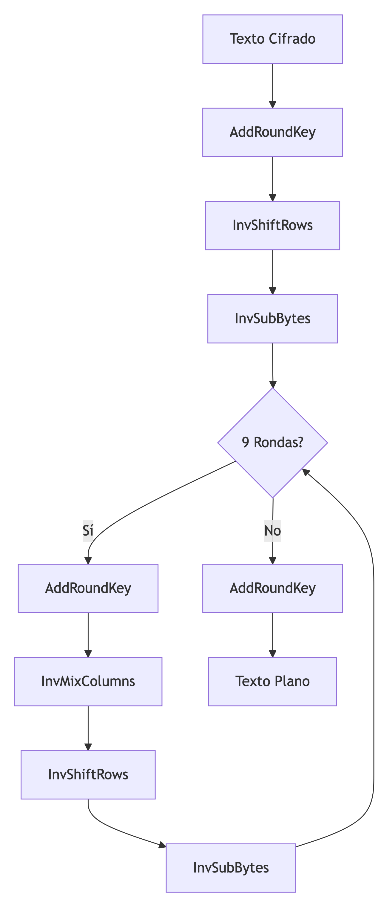
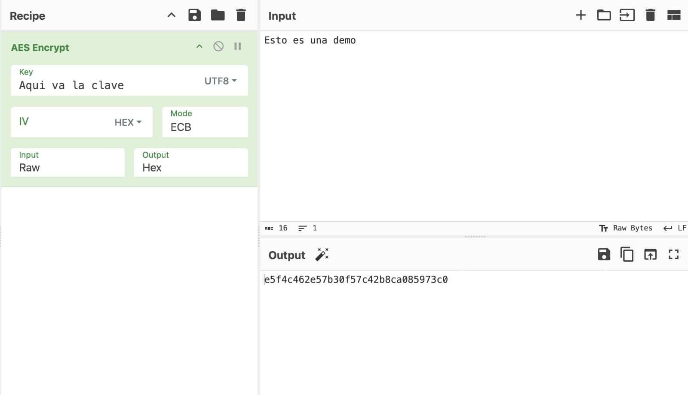

# Proyecto final - Cifrado simétrico AES

Este documento explica la implementación del algoritmo AES (Advanced Encryption Standard) para cifrado de 128 bits para la materia de Criptografía impartida en la Facultad de Ingeniería, UNAM.

---

### Realizado por: 
- Aguilar Ramos Enrique Alejandro
- Armenta Chora Luis Fabian
- Caballero Romero Ismael
- Gómez Ignacio Tania Jocelyn
- Ramírez Pérez Daniela Itzel
- Ruíz Sánchez Miguel Ángel
- Serapio Hernández Alexis Arturo
- Sierra Ruiz Nayeli Selene


---
## Componentes principales del código

### Tablas AES

1. **s_box**: Tabla de sustitución no lineal usada en la fase SubBytes. Transforma cada byte del estado según una tabla predefinida.
2. **inv_s_box**: Tabla inversa de s_box, usada para descifrar.
3. **rcon**: Constantes de ronda usadas en la expansión de clave.
---

### Funciones principales

#### 1. Transformaciones básicas

- **sub_bytes(state)**: Realiza sustitución no lineal usando la S-Box
    **Proceso**:
  - Toma una matriz 4x4 de bytes (estado)
  - Reemplaza cada byte usando la tabla `s_box`
  - Ejemplo: `0x53` → Busca en `s_box[0x53]` → Devuelve `0xED`
---
- **inv_sub_bytes(state)**: Usa `inv_s_box` para revertir la sustitución
   - **Ejemplo**: `0xED` → `inv_s_box[0xED]` → `0x53`
---
- **shift_rows(state)**: Mueve las filas de la matriz de datos
  - Fila 1: 1 posición a la izquierda
  - Fila 2: 2 posiciones
  - Fila 3: 3 posiciones
---
- **inv_shift_rows(state)**: Deshace el desplazamiento de filas.
---
- **xtime(a)**: Multiplicación por x en GF(2^8), usado en MixColumns.
---

#### 2. MixColumns

- **mix_columns(state)**: Mezcla cada columna usando matemáticas especiales (GF(2⁸))
   - **Cómo**: Multiplica y suma los bytes de cada columna
   - **Efecto**: Un cambio en un byte afecta a toda la columna
---

- **inv_mix_columns(state)**: Operación inversa con matriz diferente.
---

#### 3. Manejo de claves

- **add_round_key(state, key)**: Combina los datos con la clave usando XOR (⊕)
   - **Ejemplo**: Si dato = 0xA1 y clave = 0xB3 → resultado = 0x12
---
- **key_expansion(key)**: Crea 11 claves diferentes a partir de la clave inicial
   - **Pasos principales**:
   - Divide la clave en partes
   - Aplica rotaciones y sustituciones
   - Combina con constantes especiales
---

#### 4. Funciones principales

- **cipher(input_bytes, key)**: 
  - Convierte texto plano a matriz de estado
  - Aplica AddRoundKey inicial
  - 9 rondas con SubBytes, ShiftRows, MixColumns y AddRoundKey
  - Ronda final sin MixColumns
- **inv_cipher(ciphertext, key)**: Proceso inverso para descifrar.
---

### Flujo del programa principal

1. **Entradas**:
   - `texto_plano`: Cadena de 16 bytes ("Esto es una demo")
   - `clave`: Cadena de 16 bytes ("Aqui va la clave")

2. **Proceso**:
   - Convierte texto y clave a bytes
   - Organiza la clave en matriz 4x4 (column-major)
   - Cifra con `cipher()`
   - Descifra con `inv_cipher()`

3. **Salidas**:
   - Muestra texto original, clave, texto cifrado y resultado del descifrado.
---

### Diagrama dd Flujo Completo




---

## Notas importantes

1. **Especificaciones técnicas**:
   - Esta implementación usa **AES-128** (clave de 128 bits)
   - El modo de operación es **ECB**
   - No incluye sistema de padding (relleno), por lo que:
     - El texto a cifrar debe ser exactamente de **16 bytes**
     - La clave debe ser exactamente de **16 bytes** (128 bits)
---

## Ejemplo de uso

```python
=== Proyecto final - Cifrado simétrico AES ===

=== CIFRANDO EL MENSAJE ===

Texto plano (16 caracteres): Esto es una demo
Texto plano (hex):  4573746f20657320756e612064656d6f

Clave AES-128 (16 caracteres):       Aqui va la clave
Clave AES-128 (hex):        41717569207661206c6120636c617665

Texto Cifrado (hex):     e5f4c462e57b30f57c42b8ca085973c0


=== DESCIFRANDO EL MENSAJE ===

Texto Cifrado (hex):     e5f4c462e57b30f57c42b8ca085973c0
Clave AES-128 (16 caracteres):       Aqui va la clave
Texto Descifrado:  Esto es una demo
``` 
---
## Comprobación de resultado



---
